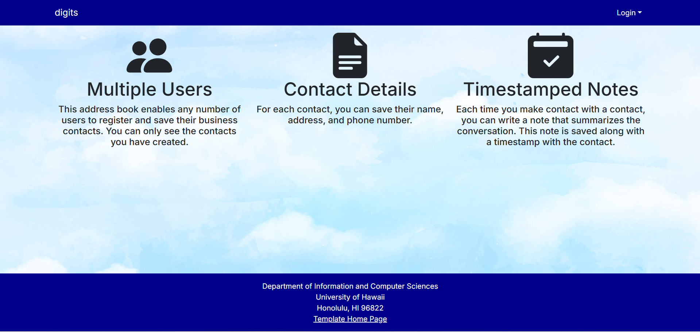
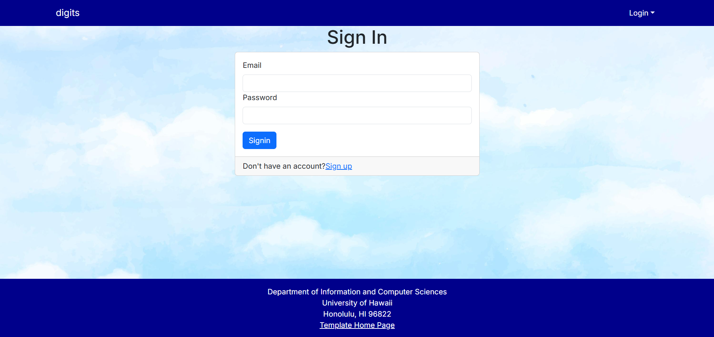
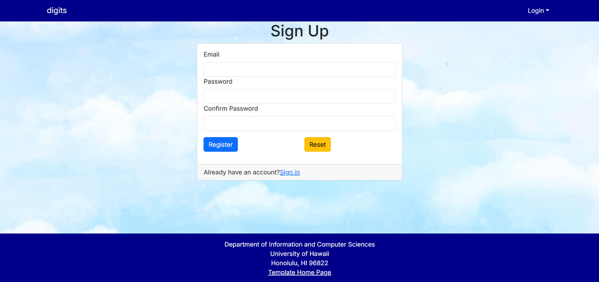
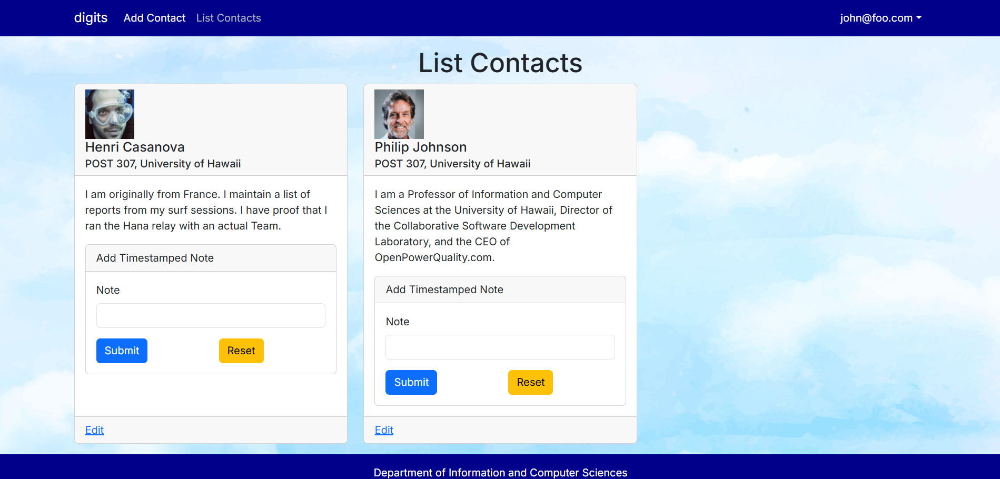
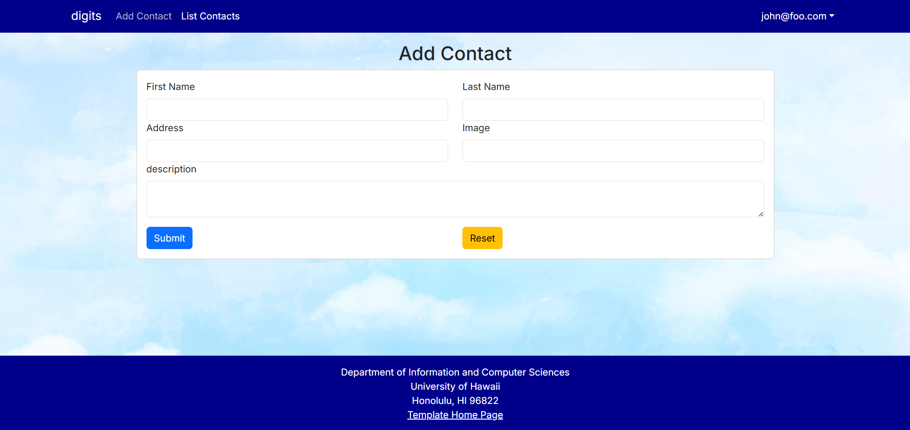
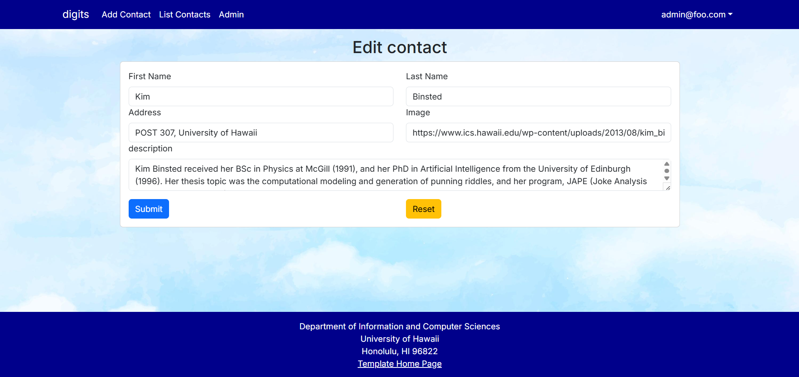
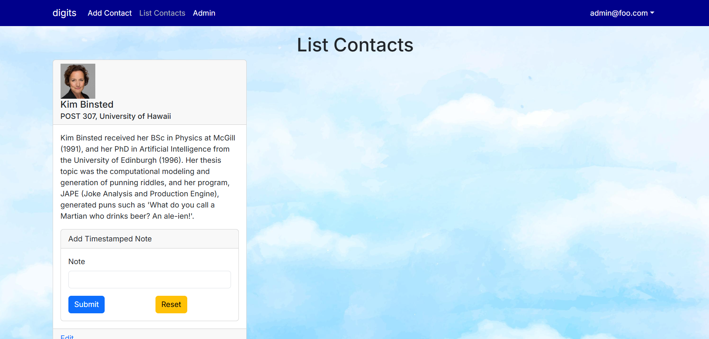
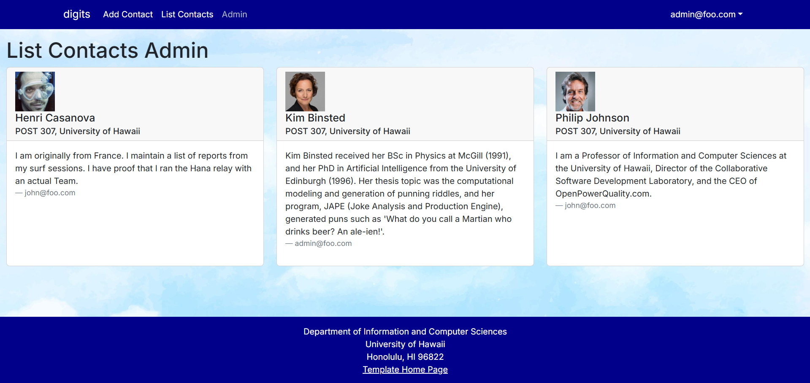
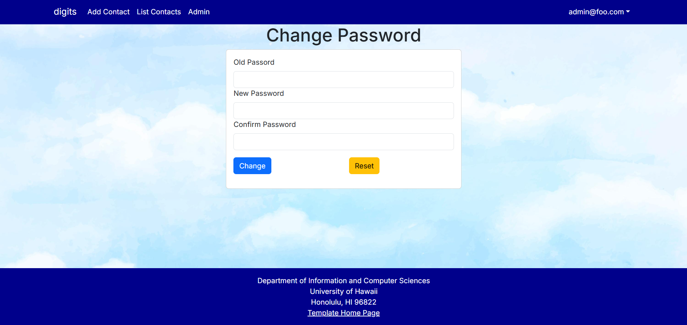
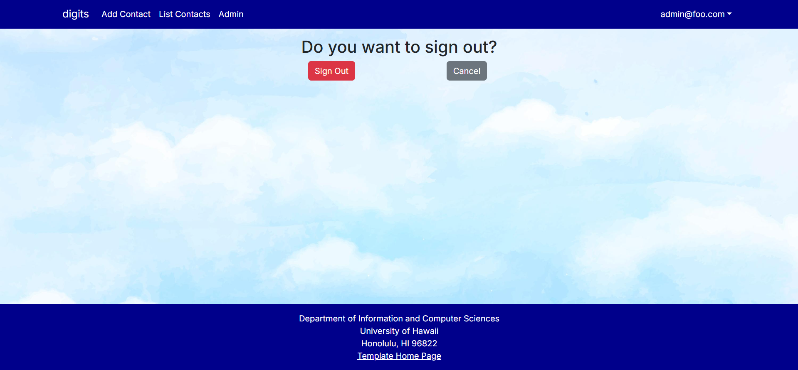

digits is a sample Next.js application that illustrates:

- A standard directory layout using 'src/' as recommended in the [Next.js Project Structure](https://nextjs.org/docs/getting-started/project-structure) guide.
- [Bootstrap 5 React](https://react-bootstrap.github.io/) for user interface.
- [React Hook Form](https://www.react-hook-form.com/) for form development.
- Authorization, authentication, and registration using [NextAuth.js](https://next-auth.js.org/).
- Initialization of users and data from a settings file.
- Alerts regarding success or failure of DB updates using [Sweet Alert](https://sweetalert.js.org/).
- Quality assurance using [ESLint](http://eslint.org) with packages to partially enforce the [Next.js ESLint rules](https://nextjs.org/docs/app/building-your-application/configuring/eslint) and the [AirBnB Javascript Style Guide](https://github.com/airbnb/javascript).

The purpose of this application is to provide a place where users can see different contacts they have made, add new contacts, edit existing contacts, and add timestamped notes to any existing contact.

## Installation

First, [install PostgreSQL](https://www.postgresql.org/download/). Then create a database for your application.

```

$ createdb digits
Password:
$

```

Second, go to [https://github.com/zeyaoz/digits](https://github.com/zeyaoz/digits), and click the "Use this template" button. Complete the dialog box to create a new repository that you own that is initialized with this template's files.

Third, go to your newly created repository, and click the "Clone or download" button to download your new GitHub repo to your local file system. Using [GitHub Desktop](https://desktop.github.com/) is a great choice if you use MacOS or Windows.

Fourth, cd into the directory of your local copy of the repo, and install third party libraries with:

```

$ npm install

```

Fifth, create a `.env` file from the `sample.env`. Set the `DATABASE_URL` variable to match your PostgreSQL database that you created in the first step. See the Prisma docs [Connect your database](https://www.prisma.io/docs/getting-started/setup-prisma/add-to-existing-project/relational-databases/connect-your-database-typescript-postgresql). Then run the Prisma migration `npx prisma migrate dev` to set up the PostgreSQL tables.

```

$ npx prisma migrate dev
Environment variables loaded from .env
Prisma schema loaded from prisma/schema.prisma
Datasource "db": PostgreSQL database "<your database name>", schema "public" at "localhost:5432"

Applying migration `20240708195109_init`

The following migration(s) have been applied:

migrations/
└─ 20240708195109_init/
└─ migration.sql

Your database is now in sync with your schema.

✔ Generated Prisma Client (v5.16.1) to ./node_modules/@prisma/client in 51ms

$

```

Then seed the database with the `/config/settings.development.json` data using `npx prisma db seed`.

```

$ npx prisma db seed
Environment variables loaded from .env
Running seed command `ts-node --compiler-options {"module":"CommonJS"} prisma/seed.ts` ...
Seeding the database
Creating user: admin@foo.com with role: ADMIN
Creating user: john@foo.com with role: USER

🌱 The seed command has been executed.
$

```

## Running the system

Once the libraries are installed and the database seeded, you can run the application by invoking the "dev" script:

```

$ npm run dev

> nextjs-application-template-1@0.1.0 dev
> next dev

▲ Next.js 14.2.24

- Local: http://localhost:3000
- Environments: .env

✓ Starting...
✓ Ready in 1619ms

```

### Viewing the running app

If all goes well, the template application will appear at [http://localhost:3000](http://localhost:3000). You can login using the credentials in settings.development.json, or else register a new account.

### ESLint

You can verify that the code obeys standard coding standards by running ESLint over the code in the src/ directory with:

```
$ npm run lint

> nextjs-application-template-1@0.1.0 lint
> next lint

✔ No ESLint warnings or errors
$
```

## Walkthrough

The following sections describe the major features of this application.

### Directory structure

The top-level directory structure is:

```

.github # holds the GitHub Continuous Integration action and Issue template.

config/ # holds configuration files, such as settings.development.json

doc/ # holds developer documentation, user guides, etc.

prisma/ # holds the Prisma ORM schema and seed.ts files.

public/ # holds the public images.

src/ # holds the application files.

tests/ # holds the Playwright acceptance tests.

.eslintrc.json # The ESLint configuration.

.gitignore # don't commit VSCode settings files, node_modules, and settings.production.json

```

This structure separates documentation files (such as screenshots) and configuration files (such as the settings files) from the actual Next.js application.

The src/ directory has this structure:

```

app/

  add/ # The add route
    page.tsx # The Add Contacts Page

  admin/
    page.tsx # The Admin Page

  api/auth/[...nextauth]/
    route.ts # The NextAuth configuration

  auth/
    change-password/
      page.tsx # The Change Password Page

    signin/
      page.tsx # The Sign In Page

    signout/
      page.tsx # The Sign Out Page

    signup/
      page.tsx # The Sign Up / Register Page

  edit/
    page.tsx # The Edit Contact Page

  list/
    page.tsx # The List Contacts Page

  not-authorized/
    page.tsx # The Not Authorized Page

  layout.tsx # The layout of the application

  page.tsx # The Landing Page

  providers.tsx # Session providers.

  components/
    AddContactForm.tsx # The React Hook Form for adding contacts.

    AddNoteForm.tsx # The React Hook Form for adding notes.

    ContactCard.tsx # The component for each contact card.

    ContactCardAdmin.tsx # The component for each contact card in the admin contacts overview page.

    EditContactForm.tsx # The Edit Contact Form.

    Footer.tsx # The application footer.

    LoadingSpinner.tsx # Indicates working.

    Navbar.tsx # The application navbar.

    NoteItem.tsx # The component for each note.

  lib/

    dbActions.ts # Functions to manipulate the Postgres database.

    page-protections.ts # Functions to check for logged in users and their roles.

    prisma.ts # Singleton Prisma client.

    validationSchemas.ts # Yup schemas for validating forms.

  tests/ # playwright acceptance tests.

```

### Application functionality

The application implements a simple contacts application for managing different contacts for each user, which is a PostgreSQL table consisting of a
id          Int    
firstName   String
lastName    String
address     String
image       String
description String
notes       Note[]
owner       String

By default, each user only sees the contact that they have created. However, the settings file enables you to define default accounts. If you define a user with the role "admin", then that user gets access to a special page which lists all the contacts defined by all users.

#### Landing page

When you retrieve the app at http://localhost:3000, this is what should be displayed:


The next step is to use the Login menu to either Login to an existing account or register a new account.

#### Login page

Clicking on the Login link, then on the Sign In menu item displays this page:



#### Register page

Alternatively, clicking on the Login link, then on the Sign Up menu item displays this page:



#### Landing (after Login) page, non-Admin user

Once you log in (either to an existing account or by creating a new one), the navbar changes as follows:



You can now add new contacts, and see the list of contacts you have created. Note you cannot see any contacts created by other users.

#### Add Contact page

After logging in, here is the page that allows you to add new contacts:



#### Edit Contact page

After clicking on the "Edit" link associated with a contact, this page displays that allows you to change and save it:



#### Landing (after Login), Admin user

You can define an "admin" user in the settings.json file. This user, after logging in, gets the same contacts page as any other user:



#### Admin page (list all users contacts)

To provide a simple example of a "super power" for Admin users, the Admin page lists all of the contacts by all of the users:



Note that non-admin users cannot get to this page, even if they type in the URL by hand.

#### Changing Password

Any user can change their old password to a specified new password after signing in. 



#### Signing Out of the Application

When a user wants to exit the application, they can confirm signing out in the signout page. 



### CSS

The application uses the [React implementation of Bootstrap 5](https://react-bootstrap.github.io/). You can adjust the theme by editing the `src/app/globals.css` file. To change the theme override the Bootstrap 5 CSS variables.

```css
/* Change bootstrap variable values.
 See https://getbootstrap.com/docs/5.2/customize/css-variables/
 */
body {
  --bs-light-rgb: 236, 236, 236;
}

/* Define custom styles */
.gray-background {
  background-color: var(--bs-gray-200);
  color: var(--bs-dark);
  padding-top: 10px;
  padding-bottom: 20px;
}
```

### Routing

For display and navigation among its four pages, the application uses [Next.js App Router](https://nextjs.org/docs/app/building-your-application/routing).

Routing is defined by the directory structure.

### Authentication

For authentication, the application uses the NextAuth package.

When the database is seeded, a settings file (such as [config/settings.development.json](https://github.com/ics-software-engineering/nextjs-application-template/blob/main/config/settings.development.json)) is used to create users and contacts in the PostgreSQL database. That will lead to a default accounts being created.

The application allows users to register and create new accounts at any time.

### Authorization

Only logged in users can manipulate Contacts (but any registered user can manipulate any Contact, even if they weren't the user that created it.)

### Configuration

The config directory is intended to hold settings files. The repository contains one file: config/settings.development.json

The .gitignore file prevents a file named settings.production.json from being committed to the repository. So, if you are deploying the application, you can put settings in a file named settings.production.json and it will not be committed.

### Quality Assurance

#### ESLint

The application includes a .eslintrc.json file to define the coding style adhered to in this application. You can invoke ESLint from the command line as follows:

```
[~/nextjs-application-template]-> npm run lint

> nextjs-application-template-1@0.1.0 lint
> next lint

✔ No ESLint warnings or errors
[~/nextjs-application-template]->
```

ESLint should run without generating any errors.

It's significantly easier to do development with ESLint integrated directly into your IDE (such as VSCode).
